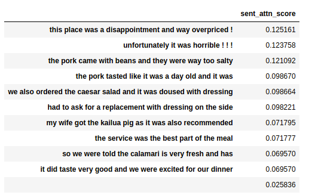
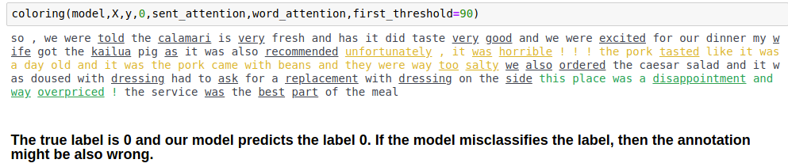

# HAN_pytorch

HAN(Zichao Yang(2016), "Hierarchical Attention Networks for Document Classification") pytorch for 1,000,000 yelp datasets

```
Language : Korean
Datasets : yelp datasets 1,000,000, label = {0,1,2,3,4}
```

- Final Accuracy :
  - HAN : 0.67
  - CNN(baseline) : 0.57

- implication : HAN model is better than baseline model when it is used at document classification. Because it uses hierarchical architecture and attention mechanism. Moreover, we can extract the attention score, and highlight the influential part of word and sentence within document which contribute to predict the label.

_______________________________________
`params = {'batch_size' : 100,
 'vocab_size' : len(word_to_idx_dict),
 'embed_size' : 200,
 'hidden_size' : 50,
 'num_layer' : 1,
 'max_sent_len' : 12,       
 'num_class' : 5
 }`

 **Highest Validation Accuracy at Epoch 15 : 0.40**

________________________________

  ` params = {'batch_size' : 100,
  'vocab_size' : len(word_to_idx_dict),
   'embed_size' : 128,
   'hidden_size' : 100,
   'num_layer' : 1,
   'max_sent_len' : 12,       
   'num_class' : 5}`

  **Highest Validation Accuracy at Epoch 15 without pretrained embedding and Layer Normalization BUT there was no weight initialization such as xavier so, word attention wasn't changed and NaN values are appeared sometimes: 0.59**
  ________________________________________
   ` params = {'batch_size' : 100,
  'vocab_size' : len(word_to_idx_dict),
   'embed_size' : 128,
   'hidden_size' : 100,
   'num_layer' : 1,
   'max_sent_len' : 12,       
   'num_class' : 5}`

  **Highest Validation Accuracy at Epoch 15 without pretrained embedding and Layer Normalization with xavier weight normalization: 0.67**

  _______________________________________

## Coloring under word attention, sentence attention
- termcolor package is used.

### Before Visualize
- low intuition and hard to understand actually, same context :)


### Visualizing under attention score



the function is in HAN.ipynb as function named `"coloring"`
